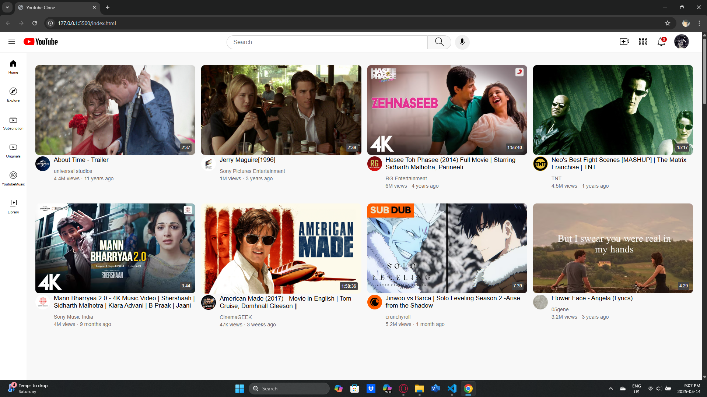

# 🎬 YouTube UI Clone

A responsive YouTube interface clone built with **HTML** and **CSS** to demonstrate fundamental web development concepts.



---

## 📋 Overview

This project is a functional replica of YouTube's user interface, developed as a learning exercise to practice **HTML** and **CSS** skills. It features a fully responsive design that adapts to various screen sizes using layout techniques like **CSS Grid**, **Flexbox**, and **positioning**.

---

## ✨ Features

- 📱 **Responsive Design**: Adapts to mobile, tablet, and desktop screens using media queries.
- 🔍 **YouTube-like Header**: Includes a search bar, navigation icons, and profile section.
- 📂 **Sidebar Navigation**: Vertical menu with hover effects for seamless navigation.
- 🎞️ **Video Grid Layout**: Dynamically adjusts based on screen width.
- 📺 **Video Cards**: Show thumbnail, duration overlay, channel logo, and metadata.
- 🖱️ **Hover Effects**: Tooltips and visual feedback on interactive elements.

---

## 🛠️ Technologies Used

- **HTML5**
- **CSS3**, with:
  - CSS Grid
  - Flexbox
  - Media Queries
  - CSS Positioning (fixed, relative, absolute)
  - CSS Variables
  - Hover Effects

---

## 📱 Responsive Breakpoints

| Device   | Layout            | Width Range      |
|----------|-------------------|------------------|
| Mobile   | Single-column      | `< 750px`         |
| Tablet   | 3-column grid      | `750px – 999px`   |
| Desktop  | 4-column grid      | `1000px and up`   |

---

## 🗂️ Project Structure

```
youtube-ui-clone/
│
├── index.html           # Main HTML structure
├── styles/
│   ├── general.css      # Base styling and reset
│   ├── header.css       # Header layout and styling
│   ├── sidebar.css      # Sidebar layout and effects
│   └── video.css        # Video grid and card design
│
├── icons/               # SVG icons and UI assets
├── photos/              # Thumbnail images
└── logos/               # Channel logo images
```

---

## 🚀 How to Run

1. **Clone the repository**:
   ```bash
   git clone https://github.com/MilanAnilAnthore/youtube-ui-clone.git
   ```

2. **Open in browser**:
   - Navigate to the folder
   - Open `index.html` in your preferred browser

---

## 📚 What I Learned

- Building complex responsive layouts with **CSS Grid** and **Flexbox**
- Creating **mobile-first designs** using media queries
- Structuring CSS for **modularity and scalability**
- Implementing interactive and accessible **UI components**
- Replicating real-world UIs through observation and practice

---

## 📝 License

This project is open source and available under the **MIT License**.

---

**Made as a learning project — Milan Anil Anthore**
